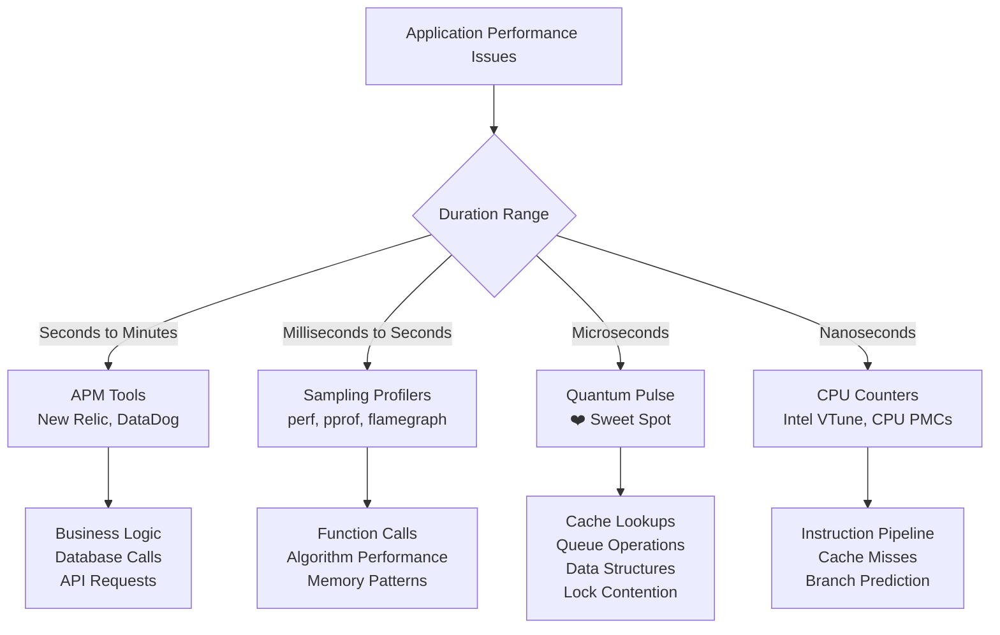
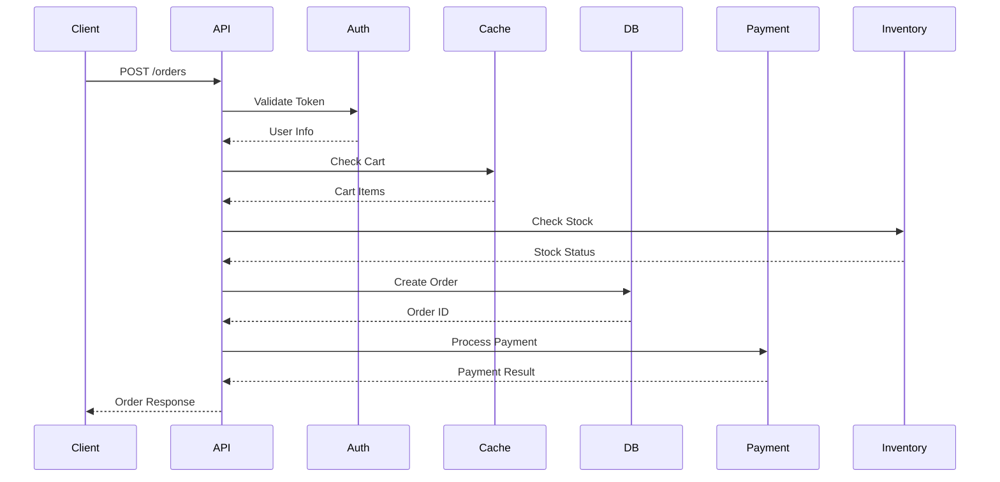
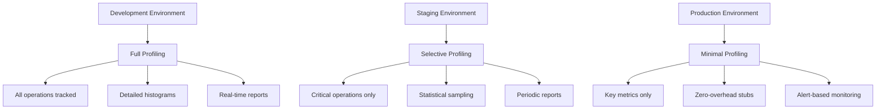

# The Quantum Pulse Guide: Bridging the Performance Gap

*A comprehensive guide to microsecond-precision profiling with type-safe enums*

---

## Table of Contents

1. [The Story of Lost Performance](#the-story-of-lost-performance)
2. [Finding Your Place in the Profiling Spectrum](#finding-your-place-in-the-profiling-spectrum)
3. [The Enum Revolution](#the-enum-revolution)
4. [Getting Started with ProfileOp: Your First Profile](#getting-started-with-profileop-your-first-profile)
5. [Real-World Journey: Building a Trading System](#real-world-journey-building-a-trading-system)
6. [The Web Service Chronicles](#the-web-service-chronicles)
7. [Advanced Patterns and Practices](#advanced-patterns-and-practices)
8. [Production Deployment Strategies](#production-deployment-strategies)
9. [Troubleshooting Your Performance Journey](#troubleshooting-your-performance-journey)

---

## The Story of Lost Performance

Picture this: You're a senior engineer at a fintech startup. Your trading algorithm is supposed to execute orders within 100 microseconds, but occasionally it spikes to 500 microseconds, causing significant losses. You fire up `perf` and get... nothing useful. The sampling profiler shows your main trading loop, but everything inside appears as noise. You know the bottleneck is somewhere in your order validation, market data lookup, or risk calculation, but which one?

This is the story of lost performance—the microseconds that slip through the cracks of traditional profiling tools. It's the gap between what sampling profilers can see (operations taking milliseconds or more) and what CPU performance counters measure (nanosecond-level instruction timing). 

**Quantum Pulse was born to fill this gap.**

### The Performance Profiling Landscape



Most performance problems in high-performance applications occur in the microsecond range:
- Database query execution: 10-1000μs
- Cache operations: 1-100μs  
- Memory allocations: 1-50μs
- Network round trips: 100-5000μs
- Data structure operations: 0.1-10μs

These operations are too fast for sampling profilers (which typically sample every millisecond) but too complex for CPU counters (which measure individual instructions).

---

## Finding Your Place in the Profiling Spectrum

Before diving into Quantum Pulse, let's understand where it fits in your performance toolkit:

### When to Use Traditional Profilers
- Your application has obvious performance problems visible at the function level
- Operations take milliseconds or longer
- You're doing initial performance analysis
- You need to understand overall program structure and hotspots

### When to Use Quantum Pulse
- You've identified a hot function but need to understand what's slow inside it
- You're building high-frequency, low-latency systems
- You need to profile operations in the 1-1000 microsecond range
- You want type-safe, maintainable profiling code
- You need detailed statistics and categorization

### When to Use CPU Performance Counters
- You're optimizing individual algorithms down to the instruction level
- You need to understand cache miss patterns or branch prediction
- You're working at the nanosecond scale
- You're doing system-level performance tuning

---

## The Enum Revolution with ProfileOp

Here's where Quantum Pulse differs fundamentally from other profiling libraries: **it enforces type-safe profiling through enums with automatic implementation via the ProfileOp derive macro**. No more string literals scattered throughout your codebase. No more typos causing lost profiling data. No more wondering what operations actually belong together. And best of all, no boilerplate code!

### The Power of ProfileOp

With the `ProfileOp` derive macro, you get:
1. **Automatic trait implementation** - just derive and annotate
2. **Built-in category management** - categories are defined once and reused
3. **Support for complex enums** - unit, tuple, and struct variants all work
4. **Zero runtime overhead** - everything compiles away in production

### The Problem with String-Based Profiling

Traditional profiling libraries encourage this pattern:

```rust
// DON'T DO THIS - This is the old, error-prone way
profile!("user_auth" => { authenticate_user() });
profile!("usr_auth" => { check_permissions() });  // Oops, typo!
profile!("cache_lookup" => { get_from_cache() });
profile!("Cache_Lookup" => { get_from_cache() }); // Another variant!
```

Problems with this approach:
- **Typos create phantom operations** that appear in reports
- **Inconsistent naming** makes analysis difficult  
- **No compile-time verification** of operation names
- **No category management** - operations are just strings
- **Manual boilerplate** for implementing traits
- **No logical grouping** of related operations
- **Refactoring is dangerous** - changing strings breaks historical data

### The ProfileOp Solution (Recommended)

Quantum Pulse provides a derive macro that eliminates all these problems:

```rust
use quantum_pulse::{ProfileOp, profile};

#[derive(Debug, ProfileOp)]
enum AuthOps {
    #[category(name = "Authentication", description = "User authentication")]
    UserAuth,
    
    #[category(name = "Authentication")]  // Reuses description
    CheckPermissions,
    
    #[category(name = "Cache", description = "Cache operations")]
    CacheLookup,
}

// Type-safe, categorized, zero boilerplate!
profile!(AuthOps::UserAuth, { authenticate_user() });
profile!(AuthOps::CheckPermissions, { check_permissions() });
profile!(AuthOps::CacheLookup, { get_from_cache() });
```

Benefits of this approach:
- **Compile-time verification** - typos become compile errors
- **Automatic categorization** - operations are grouped intelligently
- **Zero boilerplate** - no manual trait implementations
- **Self-documenting** - the enum is your operation catalog
- **IDE support** - autocomplete and refactoring work perfectly
- **Refactoring safety** - renaming operations updates all references

### Alternative: Manual Implementation

Quantum Pulse takes a radically different approach:

```rust
// Manual implementation (when you need custom behavior)
#[derive(Debug)]
enum TradingOperation {
    // Market operations
    OrderValidation,
    RiskAssessment, 
    OrderExecution,
    
    // Analytics operations
    PriceDataLookup,
    VolatilityCalculation,
    MarketDepthAnalysis,
    
    // Post-trade operations
    PositionUpdate,
    PnlCalculation,
    ExposureCheck,
}

impl Operation for TradingOperation {}

impl Category for TradingOperation {
    fn description(&self) -> Option<&str> {
        match self {
            Self::OrderValidation => Some("Validating incoming trading orders"),
            Self::RiskAssessment => Some("Calculating risk metrics for trades"),
            Self::PriceDataLookup => Some("Fetching current market prices"),
            // ... more descriptions
            _ => None,
        }
    }
}

// Usage - compile-time verified, refactoring-safe
profile!(TradingOperation::OrderValidation => {
    validate_order(&order)
});

profile!(TradingOperation::RiskAssessment => {
    calculate_risk(&order, &portfolio)
});
```

### Benefits of the Enum Approach

1. **Compile-Time Safety**: Typos become compilation errors
2. **IDE Support**: Auto-completion shows all available operations
3. **Refactoring Safety**: Renaming operations updates all references
4. **Logical Grouping**: Related operations are grouped together
5. **Self-Documenting**: The enum serves as documentation of what you're measuring
6. **Category Mapping**: Each operation automatically maps to logical categories

---

## Getting Started with ProfileOp: Your First Profile

Let's build your first Quantum Pulse-enabled application step by step.

### Step 1: Define Your Operations

Think about what you want to measure in your application. Don't try to measure everything—focus on operations that:
- Take microseconds to milliseconds
- Are called frequently
- Might be performance bottlenecks
- You want to track over time

```rust
use quantum_pulse::{ProfileOp, profile, ProfileCollector};

#[derive(Debug, ProfileOp)]
enum WebServerOperation {
    // Request handling
    #[category(name = "Request", description = "HTTP request processing")]
    RequestParsing,
    
    #[category(name = "Auth", description = "Authentication and authorization")]
    Authentication,
    
    #[category(name = "Auth")]
    Authorization,
    
    #[category(name = "Processing", description = "Business logic processing")]
    RequestProcessing,
    
    #[category(name = "Response", description = "Response formatting")]
    ResponseSerialization,
    
    // Data access
    #[category(name = "Database", description = "Database operations")]
    DatabaseQuery,
    
    #[category(name = "Cache", description = "Cache operations")]
    CacheLookup,
    
    #[category(name = "Cache")]
    CacheUpdate,
    
    // External services
    #[category(name = "External", description = "External API calls")]
    PaymentApiCall,
    
    #[category(name = "External")]
    EmailServiceCall,
    
    // Maintenance
    #[category(name = "Maintenance", description = "Background maintenance tasks")]
    SessionCleanup,
    
    #[category(name = "Maintenance")]
    MetricsAggregation,
}

// That's it! No manual trait implementations needed
```

### Step 2: Add Profiling to Your Code

Now instrument your code with profiling calls:

```rust
async fn handle_user_login(request: LoginRequest) -> Result<LoginResponse, Error> {
    // Parse and validate the request
    let credentials = profile!(WebServerOperation::RequestParsing, {
        parse_login_request(request)?
    });
    
    // Authenticate the user
    let user = profile_async!(WebServerOperation::Authentication, async {
        authenticate_user(credentials).await?
    }).await;
    
    // Check user permissions
    let permissions = profile_async!(WebServerOperation::Authorization, async {
        get_user_permissions(user.id).await?
    }).await;
    
    // Create session and return response
    let session = profile_async!(WebServerOperation::CacheUpdate, async {
        create_user_session(user.id, permissions).await?
    }).await;
    
    Ok(LoginResponse::success(session.token))
}
```

### Step 3: Generate Reports

```rust
use quantum_pulse::{ProfileCollector, ReportBuilder};

// Get basic statistics
let stats = ProfileCollector::get_all_stats();
for (operation, stat) in stats {
    println!("{}: {:.2}μs avg over {} calls", 
             operation, stat.mean().as_micros(), stat.count);
}

// Generate detailed report
let report = ReportBuilder::new()
    .group_by_category(true)
    .include_percentiles(true)
    .build();

println!("{}", report.to_string());
```

---

## Real-World Journey: Building a Trading System

Let's follow the journey of building a high-frequency trading system to see how Quantum Pulse evolves with your needs.

### Chapter 1: The Initial Implementation

Sarah is building a cryptocurrency arbitrage system. It needs to detect price differences across exchanges and execute trades within 100 microseconds. Her initial implementation looks promising in backtests, but live trading shows inconsistent performance.

```rust
use quantum_pulse::{ProfileOp, profile, profile_async};

#[derive(Debug, ProfileOp)]
enum ArbitrageOperation {
    #[category(name = "DataFeed", description = "Price feed processing")]
    PriceFeedParsing,
    
    #[category(name = "Analysis", description = "Market analysis and opportunity detection")]
    ArbitrageDetection,
    
    #[category(name = "Trading", description = "Order management")]
    OrderCreation,
    
    #[category(name = "Trading")]
    OrderSubmission,
    
    #[category(name = "Portfolio", description = "Position and portfolio updates")]
    PositionUpdate,
}

async fn process_price_update(price_feed: PriceFeed) -> Result<(), TradingError> {
    let prices = profile!(ArbitrageOperation::PriceFeedParsing, {
        parse_price_feed(price_feed)?
    });
    
    let opportunities = profile!(ArbitrageOperation::ArbitrageDetection, {
        detect_arbitrage_opportunities(&prices)?
    });
    
    for opportunity in opportunities {
        let orders = profile!(ArbitrageOperation::OrderCreation, {
            create_arbitrage_orders(&opportunity)?
        });
        
        profile_async!(ArbitrageOperation::OrderSubmission, async {
            submit_orders_parallel(orders).await?
        }).await;
        
        profile!(ArbitrageOperation::PositionUpdate, {
            update_positions(&opportunity)?
        });
    }
    
    Ok(())
}
```

After running for a day, Sarah generates her first report:

```
ArbitrageOperation::PriceFeedParsing: 12.5μs avg over 45,230 calls
ArbitrageOperation::ArbitrageDetection: 45.2μs avg over 45,230 calls  
ArbitrageOperation::OrderCreation: 23.1μs avg over 1,250 calls
ArbitrageOperation::OrderSubmission: 450.8μs avg over 1,250 calls ⚠️
ArbitrageOperation::PositionUpdate: 8.3μs avg over 1,250 calls
```

**Discovery**: Order submission is taking 450μs on average—far too slow for profitable arbitrage!

### Chapter 2: Drilling Down

Sarah realizes she needs more granular profiling of the order submission process:

```rust
#[derive(Debug, Clone, PartialEq, Eq, Hash)]
enum ArbitrageOperation {
    // ... previous operations ...
    
    // Detailed order submission breakdown
    OrderSerialization,
    NetworkLatency,
    ExchangeProcessing,
    ResponseParsing,
    
    // Risk management
    PreTradeRiskCheck,
    PostTradeRiskUpdate,
}

async fn submit_orders_parallel(orders: Vec<Order>) -> Result<Vec<OrderResult>, TradingError> {
    let mut results = Vec::new();
    
    for order in orders {
        // Pre-trade risk check
        profile!(ArbitrageOperation::PreTradeRiskCheck => {
            validate_risk_limits(&order)?
        });
        
        // Serialize order for transmission
        let serialized = profile!(ArbitrageOperation::OrderSerialization => {
            serialize_order(&order)?
        });
        
        // Submit to exchange (this was the slow part!)
        let response = profile!(ArbitrageOperation::NetworkLatency => async {
            http_client.post(&order.exchange_url)
                .body(serialized)
                .send()
                .await?
        });
        
        // Parse response
        let result = profile!(ArbitrageOperation::ResponseParsing => {
            parse_order_response(response.body())?
        });
        
        // Update risk metrics
        profile!(ArbitrageOperation::PostTradeRiskUpdate => {
            update_risk_metrics(&order, &result)
        });
        
        results.push(result);
    }
    
    Ok(results)
}
```

New profiling results reveal the true bottleneck:

```
ArbitrageOperation::OrderSerialization: 2.1μs avg over 1,250 calls
ArbitrageOperation::NetworkLatency: 425.3μs avg over 1,250 calls ⚠️⚠️
ArbitrageOperation::ResponseParsing: 18.4μs avg over 1,250 calls  
ArbitrageOperation::PreTradeRiskCheck: 3.2μs avg over 1,250 calls
ArbitrageOperation::PostTradeRiskUpdate: 1.8μs avg over 1,250 calls
```

**Discovery**: Network latency is the real problem! The code is fine, but they need to optimize network connections, use connection pooling, and possibly move closer to exchange servers.

### Chapter 3: The Optimization Journey

After moving to a colocation facility and implementing connection pooling:

```rust
#[derive(Debug, Clone, PartialEq, Eq, Hash)]
enum ArbitrageOperation {
    // ... previous operations ...
    
    // New optimizations to track
    ConnectionPoolAcquisition,
    ConnectionPoolReturn,
    RequestBatching,
    ParallelOrderSubmission,
}

// New optimized submission with connection pooling
async fn submit_orders_optimized(orders: Vec<Order>) -> Result<Vec<OrderResult>, TradingError> {
    // Group orders by exchange for batching
    let batched_orders = profile!(ArbitrageOperation::RequestBatching => {
        group_orders_by_exchange(orders)
    });
    
    let mut futures = Vec::new();
    
    for (exchange, exchange_orders) in batched_orders {
        let future = async move {
            // Get connection from pool
            let connection = profile!(ArbitrageOperation::ConnectionPoolAcquisition => {
                connection_pool.get_connection(&exchange).await?
            });
            
            // Submit all orders for this exchange in parallel
            let results = profile!(ArbitrageOperation::ParallelOrderSubmission => async {
                submit_batch(&connection, exchange_orders).await
            });
            
            // Return connection to pool
            profile!(ArbitrageOperation::ConnectionPoolReturn => {
                connection_pool.return_connection(connection)
            });
            
            results
        };
        
        futures.push(future);
    }
    
    // Wait for all exchanges to complete
    let all_results = futures::future::try_join_all(futures).await?;
    Ok(all_results.into_iter().flatten().collect())
}
```

Final results after optimization:

```
ArbitrageOperation::NetworkLatency: 45.2μs avg over 1,250 calls ✅
ArbitrageOperation::ConnectionPoolAcquisition: 1.2μs avg over 245 calls
ArbitrageOperation::ParallelOrderSubmission: 38.1μs avg over 245 calls
ArbitrageOperation::RequestBatching: 5.4μs avg over 1,250 calls
```

**Success!** The system now consistently executes arbitrage trades within the 100μs target.

### Key Lessons from the Trading System Journey

1. **Start broad, then drill down**: Begin with high-level operations, then add detail where needed
2. **Enum evolution**: It's okay to add new operations to your enum as you discover bottlenecks
3. **Measure, don't guess**: Sarah's intuition about slow serialization was wrong—network was the issue
4. **Categories help**: Grouping related operations makes patterns more visible
5. **Microsecond precision matters**: In HFT, the difference between 45μs and 450μs is profitability

---

## The Web Service Chronicles

Let's explore how Quantum Pulse evolves with a different type of system: a high-traffic web API.

### The E-commerce API Story

DevCorp is building an e-commerce API that needs to handle 10,000 requests per second. Each request involves multiple database queries, cache operations, and external service calls. The team needs to ensure no single operation becomes a bottleneck.



Each step in this sequence needs to be measured and optimized.

### Phase 1: Basic Request Profiling

```rust
#[derive(Debug, Clone, PartialEq, Eq, Hash)]
enum EcommerceOperation {
    // Request lifecycle
    RequestDeserialization,
    RequestValidation,
    ResponseSerialization,
    
    // Authentication & Authorization
    TokenValidation,
    UserDataLookup,
    PermissionCheck,
    
    // Business logic
    CartOperations,
    InventoryCheck,
    PricingCalculation,
    OrderCreation,
    
    // External services
    PaymentProcessing,
    ShippingCalculation,
    EmailNotification,
    
    // Data access
    DatabaseRead,
    DatabaseWrite,
    CacheGet,
    CacheSet,
}

impl Category for EcommerceOperation {
    fn description(&self) -> Option<&str> {
        match self {
            Self::TokenValidation => Some("Validating JWT authentication tokens"),
            Self::CartOperations => Some("Managing shopping cart state"),
            Self::PaymentProcessing => Some("Processing payments via external gateway"),
            Self::DatabaseRead => Some("Reading data from PostgreSQL"),
            Self::CacheGet => Some("Reading from Redis cache"),
            _ => None,
        }
    }
    
    fn priority(&self) -> i32 {
        match self {
            // Critical path - user-facing operations
            Self::RequestDeserialization | Self::ResponseSerialization => 1,
            Self::TokenValidation | Self::PermissionCheck => 1,
            
            // Important - core business logic
            Self::CartOperations | Self::InventoryCheck => 2,
            Self::OrderCreation | Self::PricingCalculation => 2,
            
            // Supporting - data access
            Self::DatabaseRead | Self::DatabaseWrite => 3,
            Self::CacheGet | Self::CacheSet => 3,
            
            // External - can be slow but not critical path
            Self::PaymentProcessing | Self::ShippingCalculation => 4,
            Self::EmailNotification => 5,
            
            _ => 3,
        }
    }
}
```

### Phase 2: Detailed API Handler

```rust
use axum::{Json, extract::Path};

async fn create_order(
    Path(user_id): Path<u64>,
    Json(order_request): Json<CreateOrderRequest>
) -> Result<Json<OrderResponse>, ApiError> {
    
    // Parse and validate request
    let validated_request = profile!(EcommerceOperation::RequestValidation => {
        validate_order_request(order_request)?
    });
    
    // Check user authentication and permissions
    let user = profile!(EcommerceOperation::TokenValidation => async {
        get_authenticated_user(user_id).await?
    });
    
    let permissions = profile!(EcommerceOperation::PermissionCheck => async {
        check_order_permissions(&user).await?
    });
    
    // Get cart contents (cache first, then database)
    let cart = if let Some(cached_cart) = profile!(EcommerceOperation::CacheGet => async {
        redis_client.get_cart(user.id).await.ok()
    }) {
        cached_cart
    } else {
        let db_cart = profile!(EcommerceOperation::DatabaseRead => async {
            database.get_cart(user.id).await?
        });
        
        // Update cache for next time
        profile!(EcommerceOperation::CacheSet => async {
            redis_client.set_cart(user.id, &db_cart).await.ok();
        });
        
        db_cart
    };
    
    // Check inventory for all items
    let inventory_results = profile_async!(EcommerceOperation::InventoryCheck, async {
        check_inventory_availability(&cart.items).await?
    }).await;
    
    // Calculate final pricing (including taxes, discounts, etc.)
    let pricing = profile!(EcommerceOperation::PricingCalculation => {
        calculate_order_pricing(&cart, &user.location)?
    });
    
    // Create the order in database
    let order = profile!(EcommerceOperation::DatabaseWrite => async {
        database.create_order(&user, &cart, &pricing).await?
    });
    
    // Process payment
    let payment_result = profile!(EcommerceOperation::PaymentProcessing => async {
        payment_gateway.process_payment(&order, &validated_request.payment_info).await?
    });
    
    // Calculate shipping (can be done in parallel with payment)
    let shipping_info = profile!(EcommerceOperation::ShippingCalculation => async {
        shipping_service.calculate_shipping(&order, &user.address).await?
    });
    
    // Send confirmation email (fire and forget)
    tokio::spawn(async move {
        profile!(EcommerceOperation::EmailNotification => async {
            email_service.send_order_confirmation(user.email, &order).await.ok();
        });
    });
    
    // Serialize response
    let response = profile!(EcommerceOperation::ResponseSerialization => {
        OrderResponse::new(order, payment_result, shipping_info)
    });
    
    Ok(Json(response))
}
```

### Phase 3: Performance Analysis and Optimization

After running in production for a week, the team generates reports:

```rust
use quantum_pulse::{Profiler, ReportBuilder, TimeFormat};

// Weekly performance report
let report = ReportBuilder::<EcommerceOperation>::new()
    .group_by_category(true)
    .include_percentiles(true)
    .time_format(TimeFormat::Microseconds)
    .sort_by_priority()
    .build();

println!("Weekly Performance Report:\n{:#?}", report);

// Focus on slowest operations
let stats = Profiler::<EcommerceOperation>::get_all_stats();
let mut slow_operations: Vec<_> = stats.into_iter()
    .filter(|(_, stat)| stat.mean_micros > 100.0) // Focus on operations > 100μs
    .collect();
slow_operations.sort_by(|a, b| b.1.mean_micros.partial_cmp(&a.1.mean_micros).unwrap());

println!("\nSlowest Operations (>100μs average):");
for (operation, stat) in slow_operations.iter().take(10) {
    println!("{:?}: {:.1}μs avg, {:.1}μs p99, {} calls", 
             operation, stat.mean_micros, stat.max_micros, stat.count);
}
```

Sample output:
```
Slowest Operations (>100μs average):
PaymentProcessing: 2,450.3μs avg, 8,200.1μs p99, 15,240 calls
ShippingCalculation: 1,200.8μs avg, 3,450.2μs p99, 15,240 calls  
DatabaseWrite: 450.2μs avg, 1,200.5μs p99, 18,340 calls
InventoryCheck: 320.5μs avg, 890.3μs p99, 15,240 calls
DatabaseRead: 180.4μs avg, 520.1μs p99, 45,680 calls
PricingCalculation: 125.6μs avg, 340.2μs p99, 15,240 calls
```

### Phase 4: Targeted Optimizations

Based on the profiling data, the team implements targeted optimizations:

```rust
// Optimize inventory checks with batch processing
async fn check_inventory_parallel(items: &[CartItem]) -> Result<InventoryResult, InventoryError> {
    profile!(EcommerceOperation::InventoryCheck => async {
        // Instead of checking each item individually, batch them
        let item_ids: Vec<_> = items.iter().map(|item| item.product_id).collect();
        
        // Single batch call instead of N individual calls
        inventory_service.batch_check_availability(item_ids).await
    })
}

// Optimize pricing calculation with caching
fn calculate_order_pricing(cart: &Cart, location: &Location) -> Result<Pricing, PricingError> {
    profile!(EcommerceOperation::PricingCalculation => {
        // Check if we've recently calculated pricing for similar orders
        let cache_key = format!("pricing_{}_{}", cart.hash(), location.tax_zone);
        
        if let Some(cached_pricing) = pricing_cache.get(&cache_key) {
            return Ok(cached_pricing);
        }
        
        let pricing = perform_complex_pricing_calculation(cart, location)?;
        
        // Cache for 5 minutes
        pricing_cache.insert(cache_key, pricing.clone(), Duration::from_secs(300));
        
        Ok(pricing)
    })
}

// Add database connection pooling metrics
#[derive(Debug, Clone, PartialEq, Eq, Hash)]
enum EcommerceOperation {
    // ... existing operations ...
    
    // New detailed database operations
    DatabaseConnectionAcquisition,
    DatabaseQueryExecution,
    DatabaseConnectionReturn,
    
    // Cache operations breakdown
    CacheConnectionAcquisition,
    CacheNetworkLatency,
    CacheDeserialization,
}
```

### Results After Optimization

```
Performance Improvement Report:

PaymentProcessing: 2,450.3μs → 2,380.1μs (3% improvement - external service)
ShippingCalculation: 1,200.8μs → 850.4μs (29% improvement - better caching)
DatabaseWrite: 450.2μs → 320.8μs (29% improvement - connection pooling)  
InventoryCheck: 320.5μs → 85.2μs (73% improvement - batch processing) ✅
DatabaseRead: 180.4μs → 145.3μs (19% improvement - query optimization)
PricingCalculation: 125.6μs → 25.4μs (80% improvement - caching) ✅

Overall API Response Time: 15% improvement
P99 Response Time: 35% improvement
Error Rate: 12% reduction (due to fewer timeouts)
```

---

## Advanced Patterns and Practices

### The Hierarchical Profiling Pattern

As applications grow complex, you need hierarchical profiling strategies:

```rust
#[derive(Debug, Clone, PartialEq, Eq, Hash)]
enum PaymentOperation {
    // High-level payment flow
    PaymentValidation,
    PaymentProcessing,
    PaymentConfirmation,
    
    // Detailed validation steps
    CardNumberValidation,
    ExpirationDateCheck,
    CVVVerification,
    AddressVerification,
    FraudScoreCalculation,
    
    // Processing breakdown  
    PaymentGatewayRequest,
    PaymentGatewayResponse,
    TransactionLogging,
    
    // External service calls
    BankAuthorizationCall,
    FraudDetectionServiceCall,
    PaymentProviderWebhook,
}

impl Category for PaymentOperation {
    fn priority(&self) -> i32 {
        match self {
            // Critical path
            Self::PaymentProcessing | Self::PaymentValidation => 1,
            
            // Important validation steps
            Self::CardNumberValidation | Self::FraudScoreCalculation => 2,
            
            // External dependencies
            Self::BankAuthorizationCall | Self::FraudDetectionServiceCall => 3,
            
            // Logging and webhooks
            Self::TransactionLogging | Self::PaymentProviderWebhook => 4,
            
            _ => 2,
        }
    }
}

// Hierarchical profiling in action
async fn process_payment(payment_request: PaymentRequest) -> Result<PaymentResult, PaymentError> {
    profile!(PaymentOperation::PaymentProcessing => async {
        // Level 1: High-level validation
        let validated_payment = profile!(PaymentOperation::PaymentValidation => {
            // Level 2: Detailed validation steps
            profile!(PaymentOperation::CardNumberValidation => {
                validate_card_number(&payment_request.card_number)?
            });
            
            profile!(PaymentOperation::ExpirationDateCheck => {
                validate_expiration(&payment_request.expiry)?
            });
            
            profile!(PaymentOperation::CVVVerification => {
                validate_cvv(&payment_request.cvv)?
            });
            
            // Level 2: Fraud detection
            let fraud_score = profile!(PaymentOperation::FraudScoreCalculation => async {
                fraud_service.calculate_score(&payment_request).await?
            });
            
            if fraud_score > FRAUD_THRESHOLD {
                return Err(PaymentError::FraudDetected);
            }
            
            payment_request
        });
        
        // Level 1: Process the payment
        let result = profile!(PaymentOperation::PaymentGatewayRequest => async {
            gateway.process_payment(validated_payment).await?
        });
        
        // Level 1: Log the transaction
        profile!(PaymentOperation::TransactionLogging => async {
            transaction_log.record_payment(&result).await.ok(); // Don't fail on logging errors
        });
        
        Ok(result)
    })
}
```

This hierarchical approach gives you:
- **High-level overview**: `PaymentProcessing` shows total payment time
- **Detailed breakdown**: Individual validation steps show bottlenecks
- **External dependency tracking**: Separate timing for external services
- **Non-critical operation isolation**: Logging failures don't affect payment success

### The Pause/Unpause Pattern

Use `pause!()` and `unpause!()` to selectively control profiling during execution:

```rust
use quantum_pulse::{profile, pause, unpause, ProfileOp};

#[derive(Debug, ProfileOp)]
enum SystemOperation {
    #[category(name = "Core", description = "Critical business logic")]
    ProcessOrder,
    
    #[category(name = "Maintenance", description = "Background tasks")]
    CacheWarming,
    LogRotation,
    
    #[category(name = "Debug", description = "Diagnostic operations")]
    HealthCheck,
    MetricsCollection,
}

fn system_startup() {
    // Don't profile initialization overhead
    pause!();
    
    initialize_database_connections();
    load_configuration();
    setup_monitoring();
    
    // Start profiling the actual work
    unpause!();
    
    // This gets profiled
    profile!(SystemOperation::CacheWarming, {
        warm_critical_caches();
    });
    
    println!("System ready!");
}

fn batch_processing(orders: Vec<Order>) {
    for (i, order) in orders.iter().enumerate() {
        // Only profile every 10th order to reduce overhead
        if i % 10 != 0 {
            pause!();
        }
        
        profile!(SystemOperation::ProcessOrder, {
            process_order(order);
        });
        
        if i % 10 != 0 {
            unpause!();
        }
    }
}

fn debug_mode_handler() {
    if !is_debug_mode() {
        // In production, skip debug profiling
        pause!();
    }
    
    profile!(SystemOperation::HealthCheck, {
        run_comprehensive_health_checks();
    });
    
    profile!(SystemOperation::MetricsCollection, {
        collect_detailed_metrics();
    });
    
    if !is_debug_mode() {
        unpause!();
    }
}
```

**Use Cases for Pause/Unpause:**

- **Initialization exclusion**: Skip profiling setup/teardown code
- **Sampling in loops**: Profile only representative iterations
- **Debug-only operations**: Profile diagnostics only in debug builds
- **Performance-critical sections**: Disable profiling overhead during ultra-fast paths
- **Conditional profiling**: Enable/disable based on runtime conditions

### The Feature Flag Pattern

Use Rust's feature system to enable detailed profiling only when needed:

```rust
// In Cargo.toml
[features]
default = []
detailed_profiling = ["quantum-pulse/full"]
production_profiling = ["quantum-pulse/lightweight"]

// In your code
#[derive(Debug, Clone, PartialEq, Eq, Hash)]
enum DatabaseOperation {
    // Always profiled operations
    QueryExecution,
    ConnectionManagement,
    
    // Only profiled with detailed_profiling feature
    #[cfg(feature = "detailed_profiling")]
    QueryParsing,
    #[cfg(feature = "detailed_profiling")]
    QueryPlanning,
    #[cfg(feature = "detailed_profiling")]
    QueryOptimization,
    #[cfg(feature = "detailed_profiling")]
    ResultSerialization,
}

// Conditional profiling macros
macro_rules! profile_detailed {
    ($op:expr => $block:block) => {
        #[cfg(feature = "detailed_profiling")]
        {
            profile!($op => $block)
        }
        #[cfg(not(feature = "detailed_profiling"))]
        {
            $block
        }
    };
}

// Usage
async fn execute_query(sql: &str) -> Result<QueryResult, DatabaseError> {
    profile!(DatabaseOperation::QueryExecution => async {
        let parsed = profile_detailed!(DatabaseOperation::QueryParsing => {
            parse_sql(sql)?
        });
        
        let planned = profile_detailed!(DatabaseOperation::QueryPlanning => {
            create_execution_plan(parsed)?
        });
        
        let optimized = profile_detailed!(DatabaseOperation::QueryOptimization => {
            optimize_plan(planned)?
        });
        
        let raw_result = execute_plan(optimized).await?;
        
        profile_detailed!(DatabaseOperation::ResultSerialization => {
            serialize_result(raw_result)
        })
    })
}
```

### The Async Profiling Pattern

Async operations require special care to avoid timing inactive waiting periods:

```rust
use quantum_pulse::{profile, PausableTimer};

#[derive(Debug, Clone, PartialEq, Eq, Hash)]
enum AsyncOperation {
    HttpRequest,
    DatabaseQuery,
    FileUpload,
    BackgroundProcessing,
}

// Good: Profile the entire async operation
async fn fetch_user_data(user_id: u64) -> Result<UserData, Error> {
    profile_async!(AsyncOperation::HttpRequest, async {
        client.get(&format!("https://api.example.com/users/{}", user_id)).await
    }).await
}

// Better: Profile active processing time only
async fn process_large_dataset(data: Vec<Record>) -> Result<ProcessedData, Error> {
    let mut timer = PausableTimer::new(AsyncOperation::BackgroundProcessing);
    let mut results = Vec::new();
    
    for chunk in data.chunks(1000) {
        timer.resume(); // Start timing active processing
        let processed_chunk = process_chunk(chunk)?;
        timer.pause(); // Stop timing before I/O wait
        
        // This I/O wait is not counted in processing time
        save_intermediate_result(&processed_chunk).await?;
        
        results.extend(processed_chunk);
    }
    
    timer.finish(); // Records the total active processing time
    Ok(ProcessedData::new(results))
}

// Advanced: Profile overlapping async operations
async fn parallel_data_processing(requests: Vec<DataRequest>) -> Result<Vec<DataResult>, Error> {
    let futures = requests.into_iter().map(|request| {
        async move {
            let db_result = profile!(AsyncOperation::DatabaseQuery => async {
                database.fetch_data(&request).await
            });
            
            let processed = profile!(AsyncOperation::BackgroundProcessing => {
                process_data(db_result?)
            });
            
            Ok(processed)
        }
    });
    
    // All operations are profiled individually, giving accurate per-operation timing
    // even when running in parallel
    futures::future::try_join_all(futures).await
}
```

---

## Production Deployment Strategies

### The Three-Tier Profiling Strategy

Different environments need different profiling approaches:



#### Development Configuration

```rust
// Cargo.toml for development
[dependencies]
quantum-pulse = { version = "0.1", features = ["full", "histograms", "json-export"] }

// All operations profiled with full detail
#[derive(Debug, Clone, PartialEq, Eq, Hash)]
enum DevOperation {
    // HTTP layer
    RequestParsing,
    RequestValidation,
    ResponseSerialization,
    
    // Authentication
    TokenDecoding,
    TokenValidation,
    UserLookup,
    PermissionCheck,
    
    // Business logic
    DataValidation,
    BusinessRuleExecution,
    DataTransformation,
    
    // Data access
    DatabaseConnectionAcquisition,
    QueryExecution,
    QueryResultProcessing,
    
    // External services
    HttpClientSetup,
    ExternalApiCall,
    ResponseProcessing,
    
    // Infrastructure
    LoggingOverhead,
    MetricsCollection,
    HealthCheckExecution,
}
```

#### Staging Configuration

```rust
// Cargo.toml for staging - selective profiling
[dependencies]  
quantum-pulse = { version = "0.1", features = ["production"] }

// Only critical operations profiled
#[derive(Debug, Clone, PartialEq, Eq, Hash)]
enum StagingOperation {
    // Critical path only
    RequestProcessing,
    DatabaseOperation,
    ExternalServiceCall,
    
    // Performance-critical operations
    AuthenticationFlow,
    BusinessLogicExecution,
}

impl Category for StagingOperation {
    fn description(&self) -> Option<&str> {
        match self {
            Self::RequestProcessing => Some("End-to-end request processing"),
            Self::DatabaseOperation => Some("All database interactions"),
            Self::ExternalServiceCall => Some("External service dependencies"),
            _ => None,
        }
    }
}

// Sampling-based profiling for high-frequency operations
use std::sync::atomic::{AtomicU64, Ordering};
static SAMPLE_COUNTER: AtomicU64 = AtomicU64::new(0);

macro_rules! profile_sampled {
    ($op:expr => $block:block) => {
        // Profile every 100th operation
        if SAMPLE_COUNTER.fetch_add(1, Ordering::Relaxed) % 100 == 0 {
            profile!($op => $block)
        } else {
            $block
        }
    };
}
```

#### Production Configuration

```rust
// Cargo.toml for production - zero overhead
[dependencies]
quantum-pulse = { version = "0.1", default-features = false }

// Minimal operations for alerting only
#[derive(Debug, Clone, PartialEq, Eq, Hash)]
enum ProductionOperation {
    CriticalPath,      // Total request time
    DatabaseHealth,    // Database operation success/failure
    ExternalDependency // External service health
}

// Production-safe profiling with circuit breakers
struct ProductionProfiler {
    enabled: AtomicBool,
    error_count: AtomicU64,
}

impl ProductionProfiler {
    const MAX_ERRORS: u64 = 100;
    
    fn profile_safe<F, T>(&self, op: ProductionOperation, f: F) -> T 
    where F: FnOnce() -> T {
        if self.enabled.load(Ordering::Relaxed) {
            match std::panic::catch_unwind(std::panic::AssertUnwindSafe(|| {
                profile!(op => { f() })
            })) {
                Ok(result) => result,
                Err(_) => {
                    let errors = self.error_count.fetch_add(1, Ordering::Relaxed);
                    if errors > Self::MAX_ERRORS {
                        self.enabled.store(false, Ordering::Relaxed);
                        eprintln!("Profiling disabled due to too many errors");
                    }
                    f() // Execute without profiling
                }
            }
        } else {
            f()
        }
    }
}
```

### Monitoring and Alerting Integration

```rust
use quantum_pulse::{Profiler, ProfileCollector};

// Custom monitoring integration
pub struct MonitoringIntegration {
    metrics_client: MetricsClient,
    alert_thresholds: HashMap<String, AlertConfig>,
}

impl MonitoringIntegration {
    pub async fn export_metrics(&self) -> Result<(), MonitoringError> {
        let stats = Profiler::<ProductionOperation>::get_all_stats();
        
        for (operation, stat) in stats {
            let operation_name = format!("{:?}", operation);
            
            // Export to Prometheus/DataDog/etc
            self.metrics_client.gauge(
                format!("operation_latency_avg_{}", operation_name),
                stat.mean_micros
            ).await?;
            
            self.metrics_client.gauge(
                format!("operation_latency_p99_{}", operation_name),
                stat.max_micros  // In production, we might only track max as p99 approximation
            ).await?;
            
            self.metrics_client.counter(
                format!("operation_count_{}", operation_name),
                stat.count as f64
            ).await?;
            
            // Check alert thresholds
            if let Some(threshold) = self.alert_thresholds.get(&operation_name) {
                if stat.mean_micros > threshold.max_avg_latency {
                    self.send_alert(&operation_name, stat.mean_micros, threshold).await?;
                }
            }
        }
        
        Ok(())
    }
    
    async fn send_alert(&self, operation: &str, current_latency: f64, threshold: &AlertConfig) -> Result<(), MonitoringError> {
        let alert = Alert {
            severity: if current_latency > threshold.critical_latency { 
                Severity::Critical 
            } else { 
                Severity::Warning 
            },
            title: format!("High latency detected: {}", operation),
            description: format!(
                "Operation {} has average latency of {:.1}μs (threshold: {:.1}μs)", 
                operation, current_latency, threshold.max_avg_latency
            ),
            operation: operation.to_string(),
            current_value: current_latency,
            threshold: threshold.max_avg_latency,
        };
        
        self.alert_client.send_alert(alert).await
    }
}

#[derive(Clone)]
struct AlertConfig {
    max_avg_latency: f64,
    critical_latency: f64,
}

// Usage in production service
#[tokio::main]
async fn main() {
    let monitoring = MonitoringIntegration::new().await;
    
    // Export metrics every 60 seconds
    let mut interval = tokio::time::interval(Duration::from_secs(60));
    tokio::spawn(async move {
        loop {
            interval.tick().await;
            if let Err(e) = monitoring.export_metrics().await {
                eprintln!("Failed to export metrics: {}", e);
            }
        }
    });
    
    // Your main application logic here
    start_web_server().await;
}
```

---

## Troubleshooting Your Performance Journey

### Common Patterns and Anti-Patterns

#### ❌ The "Profile Everything" Anti-Pattern

```rust
// DON'T DO THIS - Over-profiling creates noise
profile!(MyOperation::FunctionEntry => {
    profile!(MyOperation::ParameterValidation => {
        validate_params()?
    });
    
    profile!(MyOperation::LoopIteration => {
        for item in items {
            profile!(MyOperation::SingleItemProcessing => {
                profile!(MyOperation::ItemValidation => {
                    validate_item(&item)?
                });
                profile!(MyOperation::ItemTransformation => {
                    transform_item(item)
                });
            });
        }
    });
});
```

**Problems:**
- Too much profiling overhead
- Reports are cluttered with noise
- Hard to identify actual bottlenecks
- Performance impact on production

#### ✅ The "Strategic Profiling" Pattern

```rust
// DO THIS - Profile at meaningful boundaries
profile!(MyOperation::BatchProcessing => {
    // Profile the entire batch, not individual items
    let validated_items: Result<Vec<_>, _> = items
        .iter()
        .map(validate_item)
        .collect();
    let validated_items = validated_items?;
    
    let transformed_items: Vec<_> = validated_items
        .into_iter()
        .map(transform_item)
        .collect();
    
    transformed_items
});

// Only profile expensive operations within the batch
if should_profile_expensive_operation() {
    profile!(MyOperation::ExpensiveSubOperation => {
        perform_expensive_computation()
    });
}
```

#### ❌ The "String Chaos" Anti-Pattern

```rust
// DON'T DO THIS - String-based profiling is error-prone
profile!("user_authentication" => { authenticate() });
profile!("user_auth" => { check_permissions() });           // Inconsistent naming
profile!("user authentication" => { validate_session() }); // Space instead of underscore  
profile!("usr_auth" => { refresh_token() });               // Typo creates separate metric
```

#### ✅ The "Type-Safe Enum" Pattern

```rust
// DO THIS - Use enums for compile-time safety
#[derive(Debug, Clone, PartialEq, Eq, Hash)]
enum UserOperation {
    Authentication,
    PermissionCheck,
    SessionValidation,
    TokenRefresh,
}

impl Operation for UserOperation {}

profile!(UserOperation::Authentication, { authenticate() });
profile!(UserOperation::PermissionCheck, { check_permissions() });
profile!(UserOperation::SessionValidation, { validate_session() });
profile!(UserOperation::TokenRefresh, { refresh_token() });
```

### Diagnostic Techniques

#### Performance Regression Detection

```rust
use quantum_pulse::{Profiler, PerformanceBaseline};

pub struct RegressionDetector {
    baselines: HashMap<String, PerformanceBaseline>,
    regression_threshold: f64, // 20% = 1.2
}

impl RegressionDetector {
    pub fn check_for_regressions(&mut self) -> Vec<PerformanceRegression> {
        let current_stats = Profiler::<MyOperation>::get_all_stats();
        let mut regressions = Vec::new();
        
        for (operation, current_stat) in current_stats {
            let operation_name = format!("{:?}", operation);
            
            if let Some(baseline) = self.baselines.get(&operation_name) {
                let performance_ratio = current_stat.mean_micros / baseline.mean_micros;
                
                if performance_ratio > self.regression_threshold {
                    regressions.push(PerformanceRegression {
                        operation: operation_name,
                        baseline_latency: baseline.mean_micros,
                        current_latency: current_stat.mean_micros,
                        regression_factor: performance_ratio,
                        confidence: calculate_confidence(&baseline, &current_stat),
                    });
                }
            } else {
                // Establish new baseline
                self.baselines.insert(operation_name, PerformanceBaseline {
                    mean_micros: current_stat.mean_micros,
                    std_dev: calculate_std_dev(&current_stat),
                    sample_count: current_stat.count,
                    recorded_at: std::time::SystemTime::now(),
                });
            }
        }
        
        regressions
    }
}

#[derive(Debug)]
struct PerformanceRegression {
    operation: String,
    baseline_latency: f64,
    current_latency: f64,
    regression_factor: f64,
    confidence: f64,
}
```

#### Load Testing Integration

```rust
use quantum_pulse::{Profiler, LoadTestReporter};

async fn run_load_test() -> Result<LoadTestResults, LoadTestError> {
    // Clear previous profiling data
    Profiler::<ApiOperation>::reset_all();
    
    // Run load test
    let load_test_future = simulate_load(
        target_rps: 1000,
        duration: Duration::from_secs(60),
        concurrent_users: 100
    );
    
    // Start profiling metrics collection
    let metrics_collection_future = collect_metrics_during_test();
    
    let (load_results, profiling_results) = tokio::try_join!(
        load_test_future,
        metrics_collection_future
    )?;
    
    // Combine results
    let combined_results = LoadTestResults {
        load_metrics: load_results,
        performance_profile: profiling_results,
        per_operation_breakdown: Profiler::<ApiOperation>::get_stats_by_category(),
    };
    
    Ok(combined_results)
}

async fn collect_metrics_during_test() -> Result<ProfilingResults, MetricsError> {
    let mut snapshots = Vec::new();
    let mut interval = tokio::time::interval(Duration::from_secs(10));
    
    for _ in 0..6 { // 6 snapshots over 60 seconds
        interval.tick().await;
        
        let snapshot = ProfilingSnapshot {
            timestamp: std::time::SystemTime::now(),
            operation_stats: Profiler::<ApiOperation>::get_all_stats(),
            memory_usage: get_memory_usage(),
            cpu_usage: get_cpu_usage(),
        };
        
        snapshots.push(snapshot);
    }
    
    Ok(ProfilingResults { snapshots })
}
```

#### Memory and CPU Correlation

```rust
use quantum_pulse::{Profiler, SystemMetrics};

pub struct PerformanceCorrelator {
    system_metrics: SystemMetrics,
}

impl PerformanceCorrelator {
    pub fn analyze_correlations(&self) -> CorrelationReport {
        let operation_stats = Profiler::<MyOperation>::get_all_stats();
        let system_stats = self.system_metrics.current_stats();
        
        let mut correlations = Vec::new();
        
        for (operation, perf_stats) in operation_stats {
            // Check if high latency correlates with high memory usage
            let memory_correlation = calculate_correlation(
                &perf_stats.latency_samples,
                &system_stats.memory_usage_samples
            );
            
            // Check if high latency correlates with high CPU usage
            let cpu_correlation = calculate_correlation(
                &perf_stats.latency_samples,
                &system_stats.cpu_usage_samples
            );
            
            correlations.push(OperationCorrelation {
                operation: format!("{:?}", operation),
                memory_correlation,
                cpu_correlation,
                avg_latency: perf_stats.mean_micros,
                recommendations: generate_recommendations(
                    memory_correlation,
                    cpu_correlation,
                    perf_stats.mean_micros
                ),
            });
        }
        
        CorrelationReport { correlations }
    }
}

fn generate_recommendations(
    memory_corr: f64,
    cpu_corr: f64,
    avg_latency: f64
) -> Vec<String> {
    let mut recommendations = Vec::new();
    
    if memory_corr > 0.7 {
        recommendations.push(
            "High correlation with memory usage detected. Consider:\n\
             - Reducing memory allocations in hot path\n\
             - Using object pooling\n\
             - Optimizing data structures".to_string()
        );
    }
    
    if cpu_corr > 0.7 {
        recommendations.push(
            "High correlation with CPU usage detected. Consider:\n\
             - Algorithm optimization\n\
             - Reducing computational complexity\n\
             - Adding caching for expensive calculations".to_string()
        );
    }
    
    if avg_latency > 1000.0 && memory_corr < 0.3 && cpu_corr < 0.3 {
        recommendations.push(
            "High latency without system resource correlation. Consider:\n\
             - Network latency issues\n\
             - External service dependencies\n\
             - I/O bottlenecks\n\
             - Lock contention".to_string()
        );
    }
    
    recommendations
}
```

### Debug Mode and Troubleshooting

#### Enabling Debug Output

```rust
// Enable debug logging
RUST_LOG=quantum_pulse=debug cargo run

// Or programmatically
use quantum_pulse::debug::DebugConfig;

DebugConfig::new()
    .enable_operation_tracing(true)
    .enable_memory_tracking(true)
    .enable_timing_validation(true)
    .apply();
```

#### Common Issues and Solutions

**Issue: "No profiling data collected"**
```rust
// Check if you're using the stub implementation
#[cfg(not(feature = "full"))]
compile_error!("Profiling requires the 'full' feature. Add features = ['full'] to Cargo.toml");

// Verify profiling is actually happening
let has_data = Profiler::<MyOperation>::has_data();
if !has_data {
    println!("Warning: No profiling data collected. Check that operations are being called.");
}
```

**Issue: "Inconsistent timing results"**
```rust
// Add measurement validation
use quantum_pulse::validation::TimingValidator;

let validator = TimingValidator::new()
    .expect_min_duration(Duration::from_nanos(100))  // Operations should take at least 100ns
    .expect_max_duration(Duration::from_millis(10))   // But not more than 10ms
    .enable_outlier_detection(true);

profile_with_validation!(MyOperation::SuspiciousOperation, validator => {
    potentially_inconsistent_operation()
});
```

**Issue: "High profiling overhead"**
```rust
// Measure profiling overhead
use std::time::Instant;

let iterations = 10_000;
let start = Instant::now();
for _ in 0..iterations {
    // Empty profile to measure overhead
    profile!(MyOperation::OverheadTest => {});
}
let overhead = start.elapsed();

println!("Profiling overhead: {:.2} ns per operation", 
         overhead.as_nanos() as f64 / iterations as f64);

// If overhead is too high, consider:
// 1. Reducing profiling frequency
// 2. Using sampling
// 3. Profiling at higher levels of abstraction
```

---

## Conclusion: Your Performance Journey Continues

Quantum Pulse is more than a profiling library—it's a philosophy of measurement-driven development. By embracing type-safe enums over error-prone strings, you've taken the first step toward maintainable, reliable performance monitoring.

### Key Principles to Remember

1. **Measure, Don't Guess**: Performance intuition is often wrong. Let data guide your optimizations.

2. **Enums Over Strings**: Type-safe profiling prevents errors and enables refactoring with confidence.

3. **Profile at the Right Level**: Not every operation needs profiling. Focus on the microsecond range where Quantum Pulse excels.

4. **Evolution Over Perfection**: Start with broad profiling, then drill down where needed.

5. **Production Readiness**: Use feature flags and sampling to minimize overhead in production.

### The Path Forward

Your performance journey doesn't end with implementing Quantum Pulse. Consider these next steps:

- **Establish Baselines**: Record performance benchmarks for critical operations
- **Automate Regression Detection**: Build pipelines that catch performance degradations early
- **Create Performance Budgets**: Set latency targets for each operation category
- **Share Knowledge**: Document your findings and share performance insights with your team

### Community and Support

Quantum Pulse thrives on community feedback and real-world use cases. Share your performance stories, contribute improvements, and help others bridge their own performance gaps.

Remember: In the microsecond realm where Quantum Pulse operates, small improvements compound into significant competitive advantages. Every microsecond you save is a microsecond your users get back, your systems become more responsive, and your business grows more efficient.

**Happy profiling, and may your microseconds be ever in your favor!** 🚀

---

*Quantum Pulse - Bridging the gap between what you think is fast and what actually is fast.*